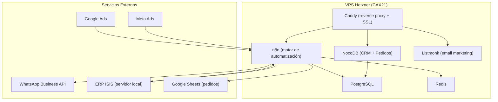

# Baigorria Industrial — Sistema de Automatización Comercial

[](#)
[](#)
[](#)

Sistema de automatización para **Baigorria Industrial** (fábrica de bulones, tuercas y espárragos, Argentina). Libera al equipo comercial de tareas operativas repetitivas para que puedan salir a la calle y concentrarse en ventas estratégicas.

---

## El problema

Una pyme industrial argentina invierte en publicidad digital, genera leads, pero su equipo comercial pierde horas en tareas manuales: mandar facturas por email, notificar estados de pedidos a clientes, responder consultas de stock, calificar leads a mano. Esas horas no se convierten en ventas.

## La solución

Un sistema que automatiza todo lo repetitivo de la operación comercial:
- Captura leads de Meta/Google Ads automáticamente
- Notifica cambios de estado de pedidos por WhatsApp
- Adjunta facturas PDF automáticamente
- Centraliza pedidos, leads y notificaciones en un solo dashboard
- El equipo comercial **no toca la base de datos**

---

## Fases del proyecto

| Fase | Alcance | Estado |
|------|---------|--------|
| **Fase 1** | CRM + captura de leads + email marketing + WhatsApp bot | En producción |
| **Fase 2** | Integración ERP ISIS + dashboard de pedidos + notificaciones automáticas + adjunto de facturas | En planificación |

---

## Arquitectura



---

## Stack tecnológico

| Herramienta | Puerto | Rol |
|-------------|:------:|-----|
| **Caddy** | 80/443 | Reverse proxy + SSL automático |
| **PostgreSQL** | 5432 | Base de datos principal |
| **Redis** | 6379 | Cache y cola de mensajes |
| **n8n** | 5678 | Motor de automatización (conecta todo) |
| **NocoDB** | 8080 | CRM + dashboard de pedidos (interfaz visual) |
| **Listmonk** | 9000 | Email marketing y secuencias automáticas |

---

## Documentación

| Documento | Contenido |
|-----------|-----------|
| [ARCHITECTURE.md](docs/ARCHITECTURE.md) | Diseño detallado del sistema, flujo de datos, componentes |
| [AGENTS.md](AGENTS.md) | Reglas y contexto para agentes de desarrollo (Claude, Codex, Copilot) |
| [Propuesta Fase 2](docs/propuesta-fase2-mvp.md) | Propuesta técnica del MVP Fase 2 (ERP + notificaciones) |
| [Propuesta Fase 1](sessions/260416-copper-fountain/plans/propuesta-baigorria.md) | Propuesta original Fase 1 (CRM + email) |
| [Setup Script](setup.sh) | Script de instalación para Ubuntu 22.04 |

---

## Setup rápido

```bash
# Requisitos: Ubuntu 22.04, dominio con DNS apuntado
# Ejecutar como root en un VPS nuevo:

git clone https://github.com/ivopaolantonio/baigorria.git
cd baigorria
chmod +x setup.sh
./setup.sh
```

El script instala todo el stack con un solo comando. Para replicar a otro cliente, cambiar 4 variables al inicio del script.

---

## Estructura del repositorio

```
baigorria/
├── README.md                   # Este archivo
├── AGENTS.md                   # Reglas para agentes de desarrollo
├── setup.sh                    # Script de instalación
├── ecosystem.config.js         # Config PM2
├── Caddyfile                   # Config reverse proxy
├── docs/
│   ├── ARCHITECTURE.md         # Arquitectura detallada
│   └── propuesta-fase2-mvp.md  # Propuesta Fase 2
├── sessions/                   # Historial de sesiones y planes
│   └── 260416-copper-fountain/
│       └── plans/
├── n8n/                        # Workflows de automatización
├── scripts/                    # Scripts auxiliares (sync ERP, etc.)
└── config/                     # Configuraciones específicas por cliente
```

---

## Contacto

Ivo Paolantonio — [ivopaolantoniopersonal@gmail.com](mailto:ivopaolantoniopersonal@gmail.com) — +54 9 11 3117-4279
