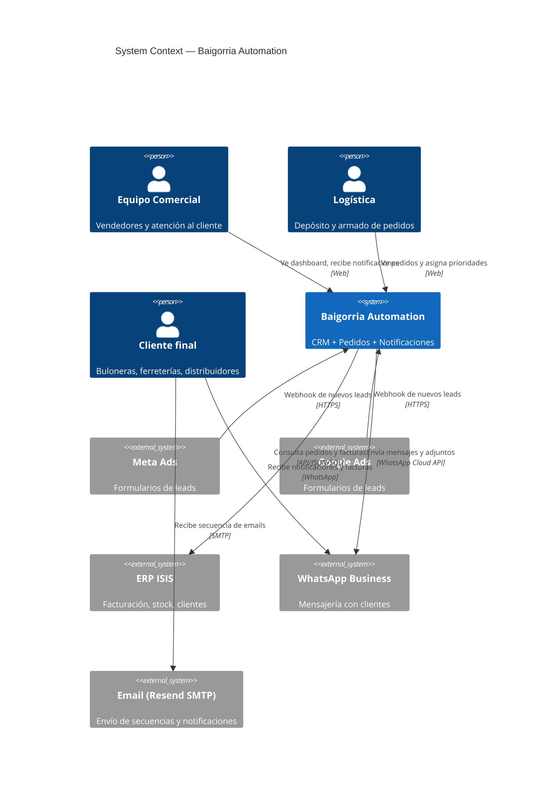
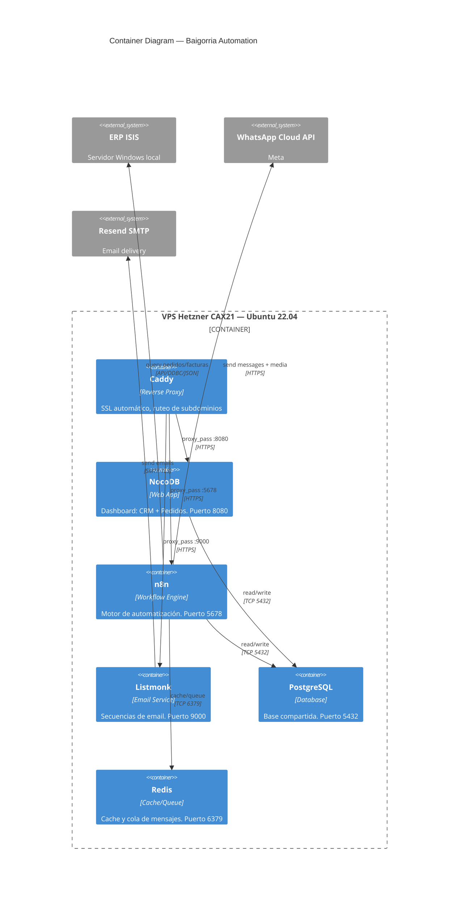
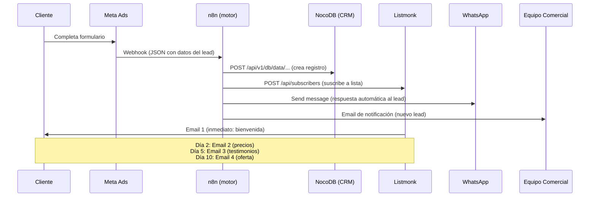
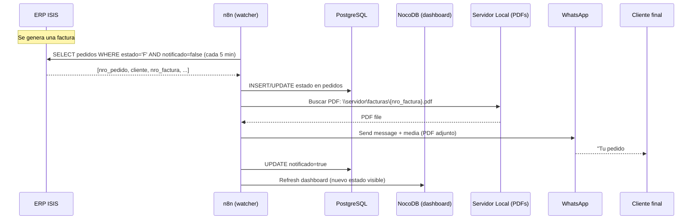
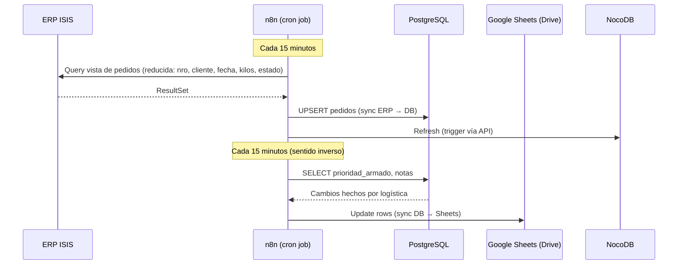
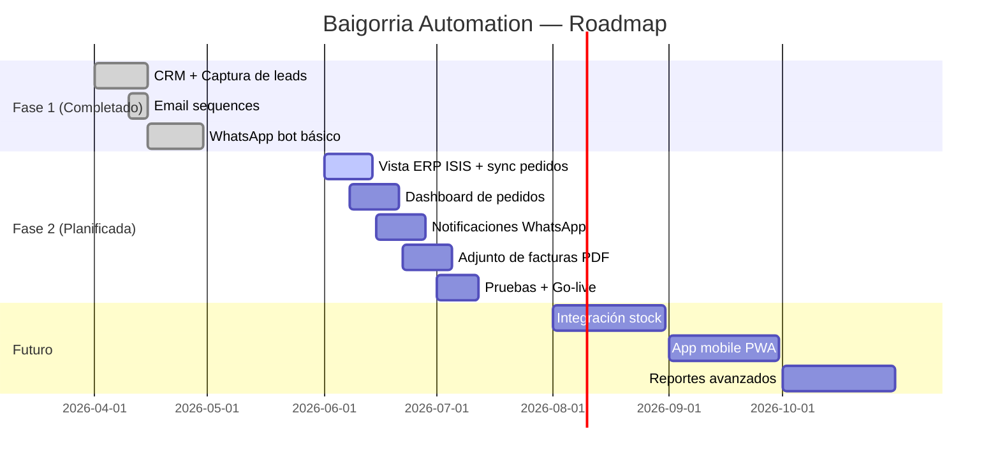

# Architecture Decision Record (ADR)
## Baigorria Industrial Automation System

> **Status:** Living document — actualizado al 2026-05-28
> **Owner:** Ivo Paolantonio
> **Audience:** Desarrolladores y agentes de IA

---

## 1. Visión general del sistema

El sistema automatiza la operatoria comercial de una pyme industrial argentina. Conecta la generación de leads (Meta/Google Ads) con el ERP interno (ISIS) y la comunicación con clientes (WhatsApp, email), todo a través de una interfaz unificada (NocoDB).

### Principios de diseño

1. **Zero-touch para el equipo comercial.** El usuario no escribe SQL, no abre el ERP, no busca archivos. Todo llega a su dashboard.
2. **Datos en capas.** Cada rol ve solo lo que necesita:
   - **Ventas:** pedidos activos, leads, notificaciones
   - **Logística:** pedidos con prioridad y kilos
   - **Admin:** todo lo anterior + datos contables del ERP
3. **Self-hosted, data ownership.** Todo corre en servidor propio. Los datos no salen de la infraestructura del cliente (excepto WhatsApp API y emails).
4. **Replicable.** Un script (`setup.sh`) replica el stack completo cambiando 4 variables.

---

## 2. Diagrama de contexto (C4 — Level 1)

---

## 3. Diagrama de contenedores (C4 — Level 2)

---

## 4. Flujo de datos principales

### 4.1 Captura de lead (Fase 1 — en producción)

### 4.2 Notificación de pedido facturado (Fase 2 — en planificación)

### 4.3 Sync bidireccional con Google Sheets (pedidos)

---

## 5. Modelo de datos

### 5.1 Tabla `leads` (NocoDB/PostgreSQL)

| Columna | Tipo | Origen | Descripción |
|---------|------|--------|-------------|
| `id` | SERIAL PK | Auto | Identificador único |
| `fecha_ingreso` | TIMESTAMP | Auto | Fecha/hora de captura |
| `nombre` | TEXT | Formulario | Nombre y apellido |
| `telefono` | TEXT | Formulario | WhatsApp / teléfono |
| `email` | TEXT UNIQUE | Formulario | Email (deduplicación) |
| `empresa` | TEXT | Formulario | Nombre de la empresa |
| `rubro` | TEXT | Formulario (dropdown) | Bulonera, Ferretería, etc. |
| `producto_interes` | TEXT | Formulario (dropdown) | Línea liviana, pesada, etc. |
| `provincia` | TEXT | Formulario | Provincia |
| `localidad` | TEXT | Formulario | Localidad |
| `origen` | TEXT | Auto (webhook) | Meta Ads / Google Ads |
| `estado` | TEXT | Manual | Nuevo / En seguimiento / Cerrado / Perdido |
| `vendedor` | TEXT | Manual | Vendedor asignado |
| `lead_score` | INTEGER | Calculado | Score basado en rubro |
| `dolor` | TEXT | Formulario | Pain point / comentarios |
| `venta_concretada` | BOOLEAN | Manual | ¿Se concretó? |
| `fecha_venta` | DATE | Manual | Fecha de cierre |
| `notas` | TEXT | Manual | Observaciones libres |
| `created_at` | TIMESTAMP | Auto | Timestamp de creación |
| `updated_at` | TIMESTAMP | Auto | Timestamp de actualización |

### 5.2 Tabla `pedidos` (NocoDB/PostgreSQL — Fase 2)

| Columna | Tipo | Origen | Descripción |
|---------|------|--------|-------------|
| `id` | SERIAL PK | Auto | Identificador |
| `nro_pedido` | TEXT UNIQUE | ERP ISIS | Número de pedido |
| `cliente_id` | INTEGER FK | ERP ISIS | FK a tabla clientes |
| `fecha_pedido` | DATE | ERP ISIS | Fecha del pedido |
| `kilos_total` | DECIMAL | ERP ISIS | Kilos totales |
| `estado` | TEXT | ERP ISIS | En proceso / Terminado / Facturado / Despachado |
| `prioridad_armado` | TEXT | Manual (logística) | Alta / Media / Baja |
| `retira_local` | BOOLEAN | ERP ISIS | ¿Lo retira el cliente? |
| `nro_factura` | TEXT | ERP ISIS | Número de factura asociada |
| `ruta_pdf` | TEXT | ERP ISIS | Ruta del PDF en servidor local |
| `notificado_facturado` | BOOLEAN | Auto (watcher) | ¿Se envió notificación? |
| `notificado_despachado` | BOOLEAN | Auto (watcher) | ¿Se envió notificación? |
| `created_at` | TIMESTAMP | Auto | Timestamp de creación |
| `updated_at` | TIMESTAMP | Auto | Timestamp de actualización |

### 5.3 Tabla `clientes` (referencia)

| Columna | Tipo | Origen |
|---------|------|--------|
| `id` | SERIAL PK | ERP ISIS |
| `nombre` | TEXT | ERP ISIS |
| `cuit` | TEXT | ERP ISIS |
| `provincia` | TEXT | ERP ISIS |
| `localidad` | TEXT | ERP ISIS |
| `telefono` | TEXT | ERP ISIS |
| `email` | TEXT | ERP ISIS |

---

## 6. Integración con ERP ISIS

### Métodos de integración (según disponibilidad del proveedor)

| Método | Prioridad | Notas |
|--------|:---------:|-------|
| **Vistas SQL (preferido)** | 1 | El proveedor ISIS genera vistas de solo lectura. n8n las consulta vía ODBC/JDBC. |
| **API REST** | 2 | Si ISIS expone endpoints REST (menos probable en versión local). |
| **Generación de JSON/CSV** | 3 | ISIS exporta archivos a una carpeta compartida. n8n los lee. |
| **Acceso directo a BD** | 4 | Último recurso, requiere credenciales de la base del ERP. |

### Estrategia de polling

- **Frecuencia:** Cada 5 minutos para estados de pedidos
- **Frecuencia para stock/pricing:** Cada 60 minutos
- **Marcador de agua:** Último `updated_at` procesado por cada tabla
- **Idempotencia:** Todas las operaciones son UPSERT (no hay duplicados)

---

## 7. Seguridad

### 7.1 Datos en tránsito

| Canal | Protección |
|-------|-----------|
| VPS → Internet | SSL/TLS (Caddy, renovación automática) |
| WhatsApp Cloud API | HTTPS + API Key rotativa |
| SMTP (Resend) | TLS |
| ERP ISIS → VPS | Depende del método: VPN/SSH tunnel si es ODBC, HTTPS si es API |

### 7.2 Datos en reposo

- PostgreSQL con autenticación por contraseña robusta
- Backups diarios automáticos
- PDFs de facturas **nunca se almacenan en el VPS** — se leen, se envían por WhatsApp, y se descartan de memoria
- Las credenciales del ERP ISIS se almacenan como variables de entorno en el VPS (no en código)

### 7.3 Acceso

| Rol | NocoDB | n8n | Listmonk |
|-----|:------:|:---:|:--------:|
| Equipo comercial | Lectura/escritura en leads y pedidos | — | — |
| Logística | Lectura/escritura en pedidos (prioridad) | — | — |
| Admin (Ivo) | Full access | Full access | Full access |
| Cliente final | — | — | — |

---

## 8. Monitoreo y alertas

| Qué se monitorea | Cómo | Alerta |
|-----------------|------|--------|
| Servicios UP | PM2 + healthcheck de Caddy | Email si algún servicio cae |
| Sync ERP → DB | Timestamp del último sync | Email si pasan > 15 min sin sync |
| Errores en WhatsApp | HTTP status codes de la API | Email + log en n8n |
| Espacio en disco | `df -h` via cron | Email si < 20% libre |
| Backups | Último backup exitoso | Email si falla |

---

## 9. Decisiones de arquitectura (ADR)

### ADR-001: NocoDB como UI en vez de frontend custom

**Decisión:** Usar NocoDB como capa de presentación para el dashboard de pedidos y CRM, en lugar de construir un frontend React/Vue.

**Razones:**
- El cliente necesita algo funcional en semanas, no meses
- NocoDB ya está corriendo (Fase 1) y el equipo lo conoce
- Permite crear vistas, filtros y kanbans sin código
- Las vistas de NocoDB funcionan como "API visual" sobre PostgreSQL

**Consecuencias:**
- Menor personalización visual (aceptable para el MVP)
- Dependencia de NocoDB (open source, sin vendor lock-in)
- En el futuro, si se necesita un frontend custom, la migración implica solo cambiar la capa de UI (la base y los workflows de n8n se mantienen)

### ADR-002: Polling en vez de webhooks para ISIS

**Decisión:** Usar polling (cron cada 5 min) para detectar cambios en el ERP ISIS, en lugar de esperar webhooks.

**Razones:**
- El ERP ISIS corre en un servidor Windows local sin exposición a internet
- Implementar webhooks requeriría exponer un endpoint del ERP (riesgo de seguridad)
- 5 minutos de latencia es aceptable para notificaciones de pedidos
- n8n tiene nodos nativos de cron + HTTP/SQL

### ADR-003: PDFs por canal de WhatsApp, no por email

**Decisión:** Enviar facturas adjuntas por WhatsApp, no por email.

**Razones:**
- El cliente pidió específicamente WhatsApp como canal principal
- WhatsApp tiene mayor tasa de apertura que email en el mercado argentino
- La API de WhatsApp Business soporta envío de documentos/media
- Los PDFs no necesitan almacenarse en el VPS (se envían y se descartan)

### ADR-004: PostgreSQL como base compartida

**Decisión:** Usar una sola instancia de PostgreSQL para todo (NocoDB, n8n, datos de sync).

**Razones:**
- Simplifica backups (un solo `pg_dump`)
- Reduce overhead de recursos en el VPS
- n8n y NocoDB ya lo usan nativamente
- La carga esperada es baja (< 1k registros/día en pedidos, < 100 leads/día)

---

## 10. Roadmap técnico

