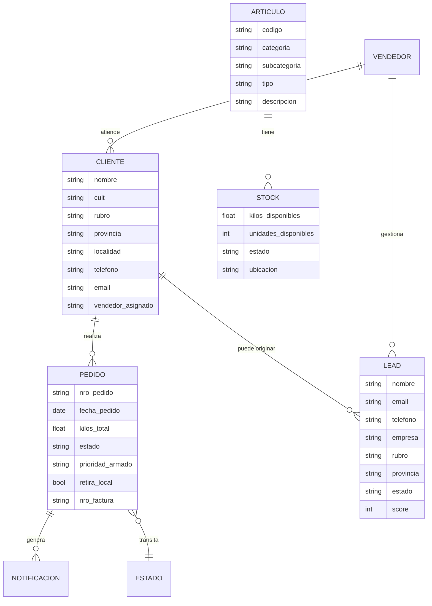
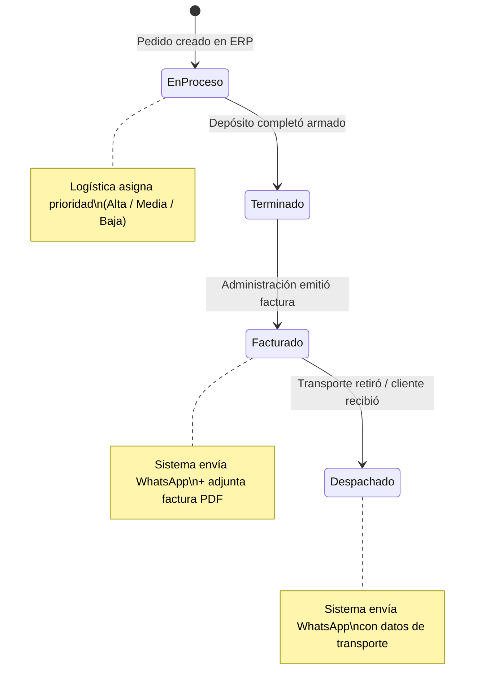
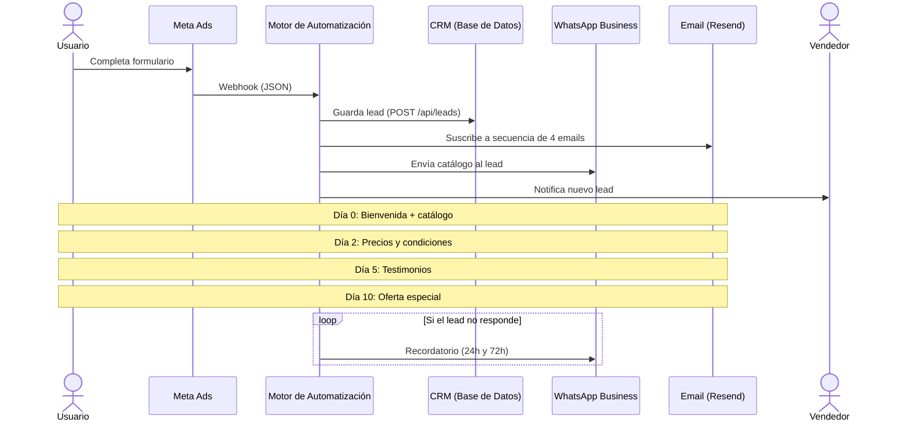
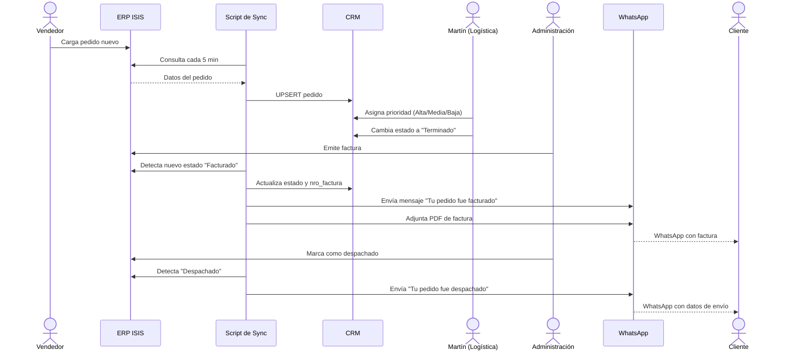
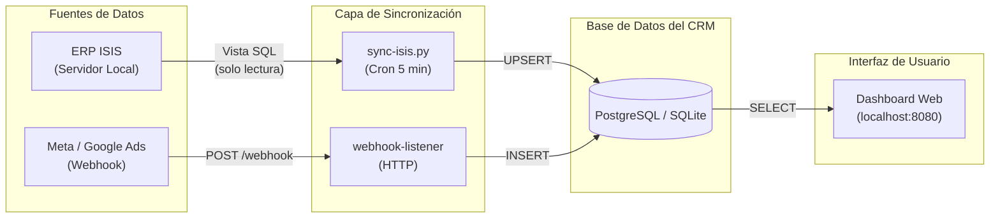
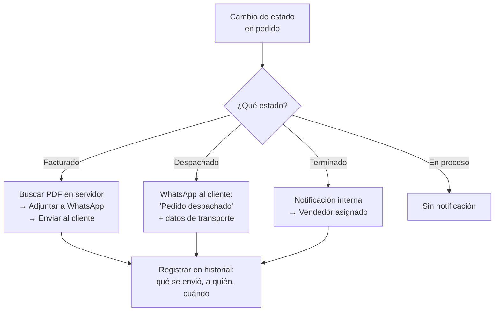
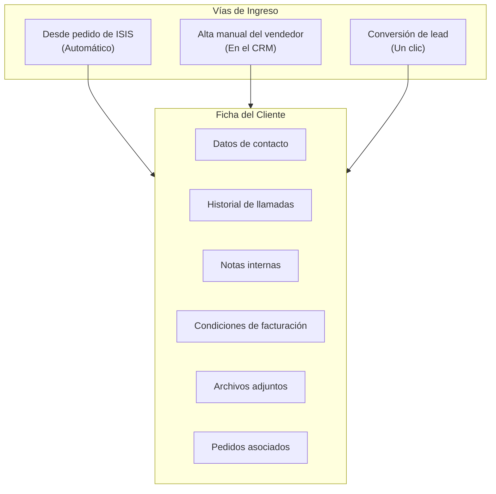
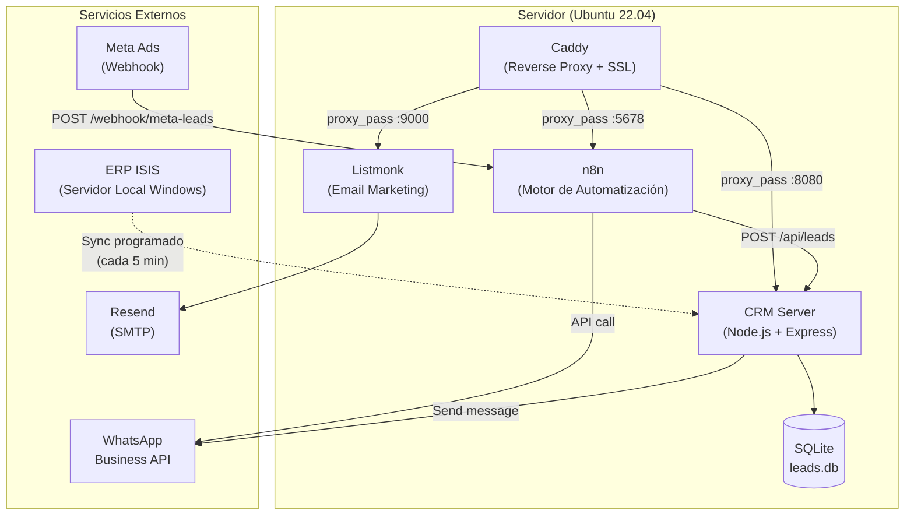

# Proyecto: Sistema de Gestión Comercial
## Baigorria Industrial

**Documento de proyecto — Versión 1.0**
**Preparado por: Ivo Paolantonio**
**Fecha: Junio 2026**

---

## 1. Resumen Ejecutivo

### El Cliente

**Baigorria Industrial** es una fábrica argentina de bulones, tuercas y espárragos. Opera con un ERP local (ISIS) y genera leads mediante campañas de Meta Ads y Google Ads. Su equipo comercial está formado por vendedores, un coordinador de logística y administración.

### El Problema

El equipo comercial dedica entre 2 y 4 horas diarias a tareas operativas que no generan ventas: mandar facturas por email una por una, notificar cambios de estado de pedidos a clientes, responder consultas de leads que no califican, y coordinar prioridades de armado con el depósito mediante planillas. Este tiempo debería estar en la calle vendiendo.

### La Solución

Un sistema de gestión comercial unificado que centraliza leads, pedidos, clientes, stock y ventas en un solo tablero. Automatiza las notificaciones a clientes por WhatsApp, adjunta facturas en PDF sin intervención humana, y permite que cada persona del equipo vea únicamente lo que necesita para su rol.

### Modalidad

**Proyecto llave en mano — pago único.** El sistema queda instalado y funcionando en la infraestructura del cliente. Incluye 30 días de garantía con corrección de errores sin costo.

---

## 2. Modelo de Negocio

### 2.1 Entidades y Relaciones



### 2.2 Jerarquía de Productos

Los artículos de Baigorria siguen una jerarquía de 4 niveles, estándar en la industria de bulonería:

```
Nivel 1: Categoría        →  Bulón
Nivel 2: Subcategoría      →  Bulón de rueda
Nivel 3: Tipo              →  Liviano
Nivel 4: Variante          →  12x1.50 zincado
```

### 2.3 Estados de un Pedido



### 2.4 Segmentación de Leads

Los leads se clasifican automáticamente con un sistema de scoring:

| Score | Clasificación | Rubros típicos | Acción recomendada |
|:-----:|:-------------:|---------------|-------------------|
| 70-100 | 🔥 Hot | Bulonera, Distribuidor, Industria | Llamar en < 2 horas |
| 40-69 | Medio | Ferretería, Casa de repuestos, Taller | Llamar en < 24 horas |
| 0-39 | ❄️ Bajo | Particular, Gomería, Sin definir | Contactar si hay disponibilidad |

El score se calcula automáticamente considerando rubro, si tiene empresa, si dejó teléfono, si dejó email, y la provincia.

---

## 3. Procesos de Negocio

### 3.1 Captura y Seguimiento de Leads



### 3.2 Ciclo de Vida del Pedido



### 3.3 Sincronización de Bases de Datos



### 3.4 Flujo de Notificaciones



### 3.5 Registro de Clientes



---

## 4. Arquitectura del Sistema

### 4.1 Diagrama de Componentes



### 4.2 Estructura del Proyecto

```
baigorria/
├── AGENTS.md                    # Reglas para agentes de IA
├── README.md                    # Documentación de entrada
├── crm/                         # Código del CRM
│   ├── server.js                # Servidor Express + SQLite + HTML inline
│   ├── leads.db                 # Base de datos SQLite (236 leads)
│   ├── page.html                # Versión standalone del frontend
│   ├── package.json             # Dependencias (express, better-sqlite3, cors)
│   └── import-sheets.js         # Script de importación desde Sheets
├── n8n/workflows/               # Workflows de automatización
├── scripts/                     # Scripts de sync y backup
├── config/                      # Configuraciones
├── docs/                        # Documentación del proyecto
│   ├── PROYECTO.md              # Este documento
│   ├── ARCHITECTURE.md          # Arquitectura detallada (ADR)
│   ├── estructura-bases-de-datos.md
│   ├── propuesta-mvp-baigorria.md
│   ├── explicacion-para-baigorria.md
│   └── respuesta-preguntas-baigorria.md
├── MVP/                         # Presentación visual
│   ├── presentacion.html        # HTML con screenshots
│   └── screen 1-9.PNG          # Capturas de pantalla
└── sessions/                    # Historial de desarrollo
```

### 4.3 Stack Tecnológico

| Componente | Tecnología | Propósito |
|-----------|-----------|----------|
| **Backend** | Node.js 20 + Express | Servidor HTTP y API REST |
| **Base de Datos** | SQLite (better-sqlite3) | Almacenamiento local, cero configuración |
| **Frontend** | HTML5 + CSS3 + Vanilla JS | Interfaz web responsive, sin frameworks |
| **Motor de Automatización** | n8n | Workflows: captura de leads, WhatsApp, email |
| **Email Marketing** | Listmonk | Secuencias automáticas de 4 emails |
| **Reverse Proxy** | Caddy | SSL automático, ruteo de dominios |
| **Process Manager** | PM2 | Mantiene los servicios corriendo 24/7 |

---

## 5. Módulos y Funcionalidades

### 5.1 Dashboard Home

Pantalla de inicio con KPIs en tiempo real:
- Total de leads, leads abiertos, pedidos activos
- Clientes registrados, stock disponible, facturación del mes
- Leads prioritarios para llamar
- Últimos pedidos modificados

### 5.2 Gestión de Leads

- Captura automática desde Meta Ads y Google Ads (vía webhook → n8n)
- Scoring automático con clasificación hot/medio/frío
- Filtros por estado, rubro, vendedor, texto libre
- Edición inline de todos los campos
- Vista Kanban por columnas de estado
- Historial de conversaciones de WhatsApp (campo chat_history)

### 5.3 Gestión de Pedidos

- Sync automático desde ERP ISIS cada 5 minutos
- Visualización de pedidos con estado, cliente, kilos y prioridad
- Filtros por estado y prioridad
- Asignación de prioridad de armado (alta/media/baja) desde el CRM
- Registro de notificaciones enviadas (facturado/despachado)
- Edición inline de notas

### 5.4 Gestión de Clientes

- Registro de clientes con datos de contacto completos
- Historial de interacciones (llamadas, notas, observaciones)
- Condiciones particulares de facturación
- Vendedor asignado
- Archivos adjuntos (cotizaciones, contratos)

### 5.5 Catálogo de Artículos

- Jerarquía de 4 niveles (categoría → subcategoría → tipo → variante)
- Códigos únicos por artículo
- Unidad de medida (kg / unidad / kit)

### 5.6 Control de Stock

- Stock agregado por artículo (kilos y unidades)
- Estado (disponible / bajo stock)
- Ubicación física en depósito

### 5.7 Historial de Ventas

- Resumen mensual por cliente
- Total facturado, kilos vendidos, ticket promedio
- Comparativa interanual

### 5.8 Analytics

- Funnel de conversión de leads
- Distribución por rubro, provincia y vendedor
- Insights automáticos (leads sin contactar, vendedor más cargado, tasa de cierre)
- KPIs cross-módulo

### 5.9 Notificaciones Automáticas

| Evento | Canal | Mensaje |
|--------|:-----:|---------|
| Nuevo lead | WhatsApp | Catálogo automático al lead |
| Nuevo lead | Email interno | Datos del lead al vendedor |
| Lead sin respuesta (24h) | WhatsApp | Recordatorio automático |
| Lead sin respuesta (72h) | WhatsApp | Último recordatorio |
| Pedido facturado | WhatsApp + PDF | "Tu pedido #XXX fue facturado" + factura adjunta |
| Pedido despachado | WhatsApp | "Tu pedido #XXX fue despachado" |
| Cliente sin compra (90 días) | Alerta interna | Tarea para el vendedor: "Contactar a X" |
| Reporte semanal | Email | Resumen automático cada lunes |

### 5.10 Seguridad y Acceso por Roles

| Rol | Ve | Puede modificar |
|-----|-----|:--------------:|
| **Vendedor** | Sus leads, pedidos de sus clientes | Estado de leads, notas de clientes |
| **Logística** | Pedidos, stock, prioridades | Prioridad, estado de armado |
| **Administrador** | Todo | Todo + asignación de vendedores |

---

## 6. Plan de Implementación

| Fase | Entregable | Dependencia |
|:----:|-----------|---|
| **1** | CRM de leads funcionando | Ninguna — ya completado |
| **2** | Dashboard de pedidos, clientes, artículos, stock y ventas con datos de ejemplo | Ninguna — ya completado |
| **3** | Conexión con ERP ISIS | Acceso a vistas SQL del proveedor ISIS |
| **4** | Notificaciones automáticas por WhatsApp | Fase 3 completada |
| **5** | Adjuntar facturas PDF en WhatsApp | Fase 3 completada |
| **6** | Alta de clientes manual y desde leads | Fase 3 completada |
| **7** | Alertas por inactividad de clientes | Fase 3 + 6 completadas |
| **8** | Capacitación del equipo (1 hora) | Todo lo anterior |
| **9** | Entrega final y go-live | Todo completado |

---

## 7. Inversión

### Modalidad: Proyecto Llave en Mano — Pago Único

| Concepto | Detalle |
|----------|---------|
| **Precio total** | **USD 1.800** |
| **Forma de pago** | 50% al inicio (USD 900) + 50% al finalizar y entregar (USD 900) |
| **Garantía** | 30 días posteriores a la entrega. Corrección de errores sin costo. |
| **Código fuente** | No incluido. El cliente recibe el sistema instalado y funcionando. |
| **Datos** | 100% propiedad del cliente. Exportables en cualquier momento. |

### Qué incluye el precio

- Instalación y configuración completa del sistema
- CRM con todos los módulos (leads, pedidos, clientes, artículos, stock, ventas, analytics)
- Sincronización con ERP ISIS (pedidos, clientes, artículos, stock)
- Motor de automatización con workflows (captura de leads, WhatsApp, email, seguimiento)
- Secuencia de 4 emails automáticos
- Notificaciones automáticas por WhatsApp con adjunto de facturas PDF
- Sistema de scoring y clasificación de leads
- Dashboard con KPIs y analytics
- Capacitación del equipo (1 hora)
- Documentación completa del sistema

### Qué NO incluye

- Código fuente (el sistema queda funcionando, no se entrega el repositorio)
- Soporte continuo post-garantía (se puede contratar por separado)
- Modificaciones o nuevas funcionalidades fuera del alcance acordado
- Migración de datos históricos (se entrega el sistema con datos nuevos a partir del go-live)
- Hardware o servidores (el sistema se instala en infraestructura provista por el cliente)

---

## 8. Condiciones

1. **Acceso a ISIS.** El cliente se compromete a gestionar con su proveedor de ERP las vistas SQL necesarias para la sincronización. Sin este acceso, las fases 4 a 7 no pueden completarse.

2. **Infraestructura.** El cliente provee el servidor (VPS o servidor local) donde se instalará el sistema. Se recomienda Ubuntu 22.04 con al menos 2 GB de RAM.

3. **Propiedad de los datos.** Todos los datos generados o almacenados por el sistema son propiedad exclusiva de Baigorria Industrial. Pueden exportarse en formato CSV/JSON en cualquier momento.

4. **Confidencialidad.** Las credenciales de acceso a ISIS y APIs externas se almacenan como variables de entorno en el servidor. No se comparten ni se almacenan en repositorios de código.

5. **Garantía.** Durante los 30 días posteriores a la entrega, cualquier error que impida el funcionamiento descrito en este documento será corregido sin costo adicional. No cubre nuevas funcionalidades ni cambios de alcance.

---

## 9. Próximos Pasos

1. ✅ Reunión de relevamiento — **Completado (28/05/2026)**
2. ✅ Propuesta y documentación del proyecto — **Completado (Junio 2026)**
3. ⏳ Confirmación del cliente y pago del 50%
4. ⏳ Gestión de acceso a vistas SQL de ISIS con el proveedor
5. ⏳ Implementación por fases según plan (sección 6)
6. ⏳ Capacitación del equipo
7. ⏳ Entrega final y pago del 50% restante

---

*Documento preparado por Ivo Paolantonio*
*Contacto: ivopaolantoniopersonal@gmail.com | +54 9 11 3117-4279*
